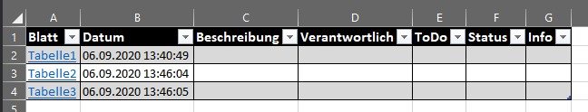

# Excel AddIn: table of contents 

## Features
- Inhaltsverzeichnis über alle sichtbaren Register generieren  
      
     
    - Neue/Gelöschte/Verschobene Register werden automatisch nachgeführt
    - Erstelldatum zu jedem neuen Register
    - Erste Spalte enthält Link um schnell ins Register zu kommen
    - Felder sind als Custom-Property auf ursprünglichen Registern gespeichert.  
    Bedeutet: Auch bei versehentlichem löschen des Inhaltsverzeichnisses bleiben die Infos erhalten! 

- Einstellungen zur Gestaltung des Inhaltsverzeichnisses  
      
    - Optional: Vorlage kann auch nur für das aktuelle Excel angepasst werden
- Es können irgendwelche Zusatzinfos pro Register gespeichert werden.  
  Sind diese nicht im Inhaltsverzeichnis definiert, sind die Werte nirgends sonst direkt ersichtlich. 
  
- Auto-Update Funktion (in Info-Dialog deaktivierbar)  
    

## Changelog
... [findet sich hier](CHANGELOG.md) ...

## Auto-Update?
Beim Starten von Excel, 1x pro 24h, wird auf GitHub die Version überprüft. Gibt es eine neuere Version, wird diese als zip-Datei heruntergeladen und entpackt. Beim nächsten Excel-Neustart wird die neuere Version dann via ClickOnce-Update nachgeführt.

Wenn Excel nie geschlossen und gestartet wird, wird auch kein Update installiert.

## Fehler melden
Es dürfen gerne [hier](https://github.com/ahaenggli/ExcelAddIn_TableOfContents/issues) in GitHub Issues erfasst werden.